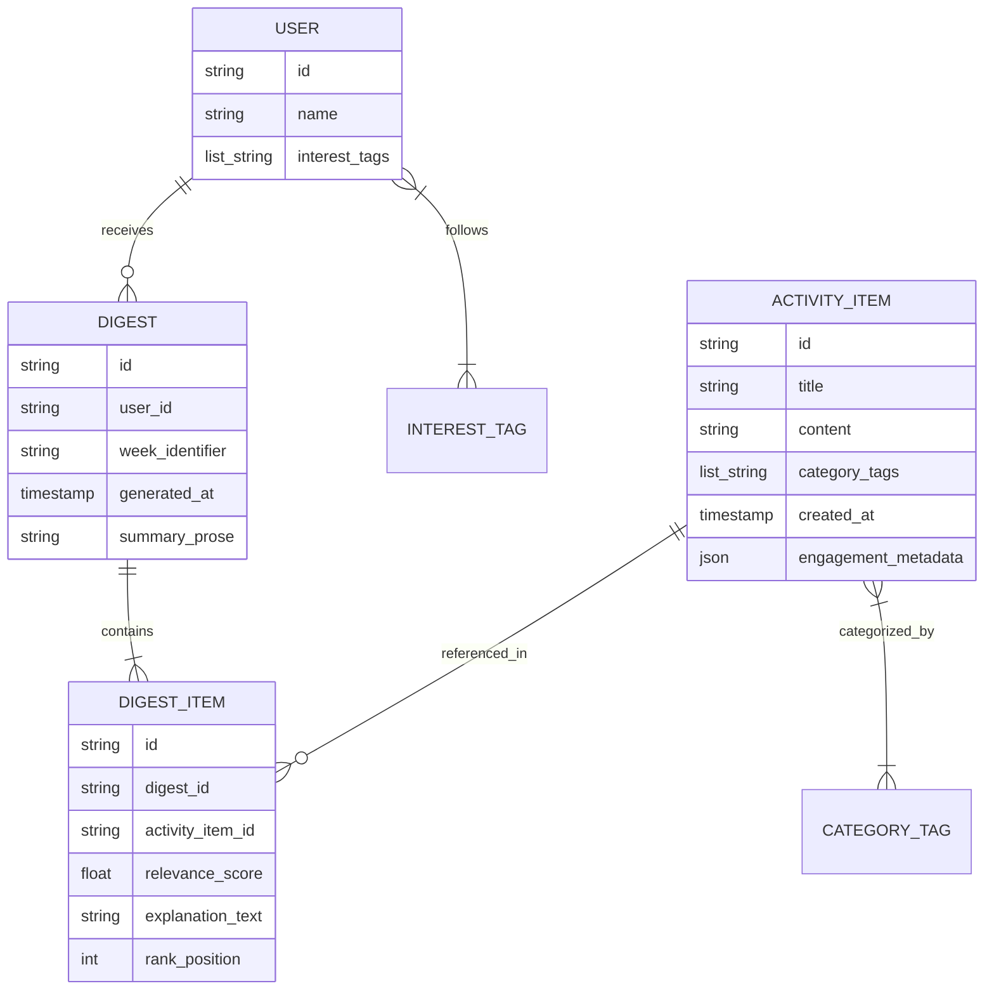
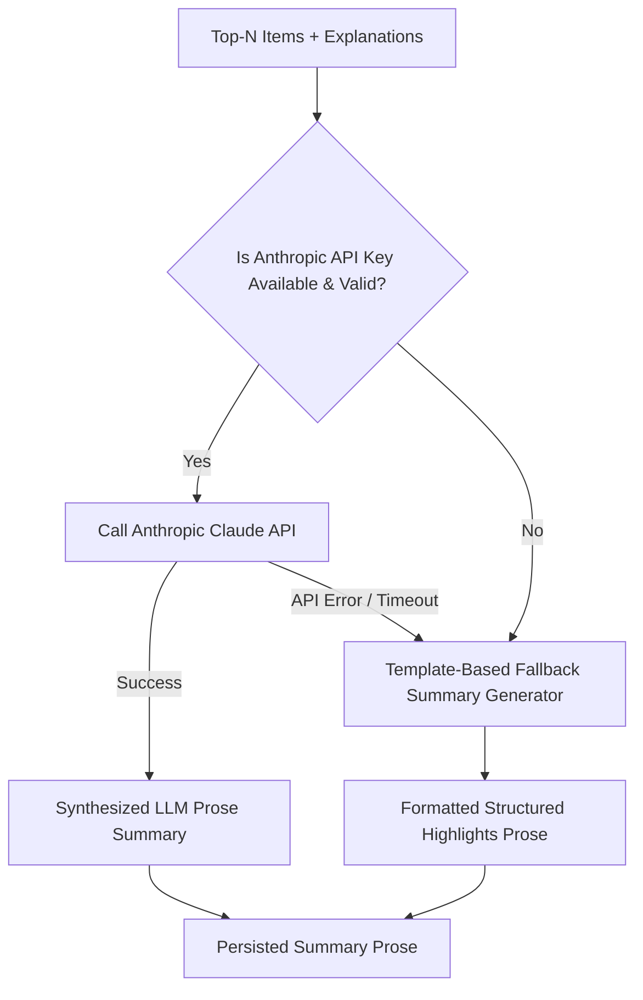
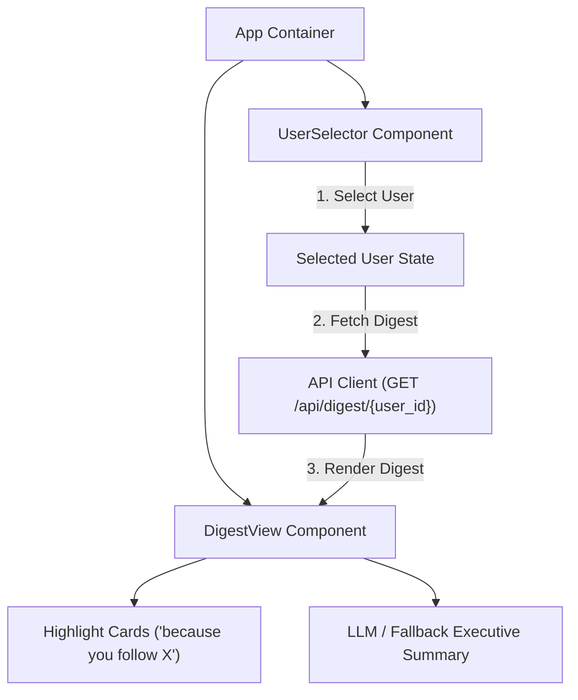

# Personalized Weekly Digest Engine — System Architecture

This document presents the complete technical architecture for the **Personalized Weekly Digest Engine**. It specifies the data models, deterministic ranking algorithms, LLM summarization strategies with template fallbacks, API contracts, frontend components, and scheduled workflow integrations.

---

## 1. System Overview

The Personalized Weekly Digest Engine aggregates weekly activity items, evaluates them against individual user preferences using a rule-based deterministic ranker, generates tailored digest summaries using Anthropic Claude (with a template-based fallback), and serves the resulting digests via a responsive web interface. A scheduled GitHub Actions workflow periodically triggers backend generation for all registered users, ensuring that every user receives an individually tailored, explainable digest each week.

```mermaid
flowchart TD
    subgraph Client ["Client Layer"]
        FE["React + Vite Frontend (Vercel)"]
    end

    subgraph Automation ["Automation Layer"]
        GHA["GitHub Actions Cron Scheduler"]
    end

    subgraph Backend ["Backend API Layer (FastAPI on Render)"]
        API["FastAPI App / Entrypoint"]
        RankerModule["Deterministic Ranker Module"]
        SummarizerModule["LLM & Template Summarizer Module"]
    end

    subgraph External ["External Services"]
        LLM["Anthropic Claude API"]
    end

    subgraph Data ["Data Layer"]
        DB[(Postgres DB on Supabase)]
    end

    %% Client Interactions
    FE -->|GET /api/users| API
    FE -->|GET /api/digest/{user_id}| API
    FE -->|POST /api/digest/{user_id}| API

    %% Scheduled Workflow
    GHA -->|POST /api/digest/{user_id}| API

    %% Internal Backend Flow
    API --> RankerModule
    RankerModule -->|Read User Interests & Activity Items| DB
    RankerModule -->|Ranked Items + Explanations| SummarizerModule
    SummarizerModule -->|Generate Prose| LLM
    SummarizerModule -.->|Fallback Prose on Failure| SummarizerModule
    SummarizerModule -->|Persist Digest| DB
```

---

## 2. Data Model (Conceptual)

The system relies on four primary entities and their relational mappings:



### Entity Specifications

1. **User Entity**
   - `id` *(String)*: Unique user identifier.
   - `name` *(String)*: Display name of the user.
   - `interest_tags` *(List of Strings)*: Topic interests defined for the user (e.g., `["AI", "Python", "Cloud"]`).

2. **ActivityItem Entity**
   - `id` *(String)*: Unique item identifier.
   - `title` *(String)*: Item title or headline.
   - `content` *(String)*: Detailed item body or description.
   - `category_tags` *(List of Strings)*: Content topics (e.g., `["Python", "FastAPI"]`).
   - `created_at` *(Timestamp)*: Publication timestamp.
   - `engagement_metadata` *(JSON)*: Numerical signals such as `views`, `likes`, `shares`, `comments`.

3. **Digest Entity**
   - `id` *(String)*: Unique digest record identifier.
   - `user_id` *(String)*: Foreign key referencing the target user.
   - `week_identifier` *(String)*: ISO week identifier (e.g., `2026-W30`).
   - `generated_at` *(Timestamp)*: Timestamp of digest creation.
   - `summary_prose` *(String)*: Executive summary generated by the Summarizer module.

4. **DigestItem Entity**
   - `id` *(String)*: Unique line item identifier.
   - `digest_id` *(String)*: Foreign key referencing the parent digest.
   - `activity_item_id` *(String)*: Foreign key referencing the underlying activity item.
   - `relevance_score` *(Float)*: Score computed by the ranker.
   - `explanation_text` *(String)*: Derived explanation string (e.g., `"because you follow Python, FastAPI"`).
   - `rank_position` *(Integer)*: 1-based order within the digest.

### Tag Connection & Relevance Mapping
The ranker evaluates the intersection between a `User`'s `interest_tags` and an `ActivityItem`'s `category_tags`. The overlapping elements explicitly form the baseline for both relevance scoring and justification generation.

---

## 3. Ranker Design (Conceptual)

The ranker is a deterministic, rule-based algorithm. It produces verifiable, reproducible scores and truth-backed explanations without relying on opaque machine learning inference or LLM calls for ranking.

### 3.1 Scoring Formula

$$\text{RelevanceScore} = w_{\text{tag}} \cdot \text{TagMatchScore} + w_{\text{recency}} \cdot \text{RecencyDecay} + w_{\text{engagement}} \cdot \text{EngagementScore}$$

Where:
1. **Tag Match Score ($S_{\text{tag}}$)**:
   $$S_{\text{tag}} = \frac{|\text{UserInterests} \cap \text{ItemTags}|}{\max(1, |\text{UserInterests}|)}$$
2. **Recency Decay ($S_{\text{recency}}$)**:
   Exponential decay based on item age in days ($t_{\text{days}}$):
   $$S_{\text{recency}} = \exp(-\lambda \cdot t_{\text{days}})$$
3. **Engagement Score ($S_{\text{engagement}}$)**:
   Normalized composite of engagement metrics:
   $$S_{\text{engagement}} = \min\left(1.0, \frac{\text{likes} \cdot 2 + \text{views} \cdot 0.1 + \text{shares} \cdot 5}{100}\right)$$
4. **Weights**:
   - $w_{\text{tag}} = 0.60$ (Primary driver: interest alignment)
   - $w_{\text{recency}} = 0.25$ (Freshness factor)
   - $w_{\text{engagement}} = 0.15$ (Community popularity factor)

### 3.2 Explanation Derivation Principle
The explanation string is **strictly derived** from the exact overlapping tags discovered during score calculation. It is **never** an LLM-hallucinated or independently invented sentence.

- **Rule**: If $\text{MatchingTags} = \text{UserInterests} \cap \text{ItemTags}$ is non-empty:
  $$\text{Explanation} = \text{"because you follow " } + \text{join}(\text{MatchingTags}, \text{", "})$$
- **Fallback**: If no tags match but the item is selected due to high engagement or recency:
  $$\text{Explanation} = \text{"popular activity item in your network this week"}$$

### 3.3 Top-N Selection Strategy
For a given user, all candidate activity items from the current week are scored. Items are sorted in descending order by `relevance_score`. The top $N$ items (default $N = 5$) are selected to form the digest items passed to the Summarizer module.

---

## 4. Summarizer Design (Conceptual)

The Summarizer module converts the top-ranked activity items and their associated explanations into cohesive, human-readable prose.



### 4.1 Input & Output Contracts
- **Input**: List of Top-N `DigestItem` objects (containing `title`, `content`, `explanation_text`).
- **Output**: Single formatted Markdown/HTML string summarizing key highlights and themes for the week.

### 4.2 Fallback Mechanism
If the Anthropic Claude API call fails (network error, rate limit, quota exhaustion, or missing API key), the Summarizer gracefully degrades to a **Template-Based Fallback**:
- Iterates over top items and formats them using structured Markdown lists:
  > **[Title]** — *[Derived Explanation]*: [Content Snippet]
- Ensures the application remains 100% operational under all external API failure conditions.

### 4.3 Module Decoupling
The Ranker and Summarizer are decoupled modules:
- The **Ranker** operates exclusively on database entities and mathematical formulas.
- The **Summarizer** accepts structured ranking outputs and produces prose.
- Both modules are independently testable via unit tests without requiring end-to-end service assembly.

---

## 5. API Design (Conceptual)

All endpoints return JSON and follow standard HTTP status codes (`200 OK`, `400 Bad Request`, `404 Not Found`, `500 Internal Server Error`).

### 5.1 `POST /api/digest/{user_id}`
Triggers generation of a new weekly digest for the specified user.

- **Method**: `POST`
- **Path**: `/api/digest/{user_id}`
- **Request Parameters**: `user_id` (Path parameter, string).
- **Request Body**: None (or optional `force_rebuild: boolean`).
- **Response Body**:
  ```json
  {
    "digest_id": "string",
    "user_id": "string",
    "week_identifier": "string",
    "generated_at": "ISO-8601 string",
    "summary_prose": "string",
    "items": [
      {
        "activity_item_id": "string",
        "title": "string",
        "relevance_score": 0.95,
        "explanation_text": "because you follow Python, FastAPI",
        "rank_position": 1
      }
    ]
  }
  ```
- **Error Cases**:
  - `404 Not Found`: User ID does not exist.
  - `500 Internal Server Error`: Database failure during digest generation.

---

### 5.2 `GET /api/digest/{user_id}`
> **Note**: *Inferred/necessary addition, not explicitly stated in requirements*. Added to enable the frontend to render the last generated digest immediately upon page load without triggering a full LLM/re-ranking regeneration cycle.

- **Method**: `GET`
- **Path**: `/api/digest/{user_id}`
- **Request Parameters**: `user_id` (Path parameter, string).
- **Response Body**: Identical structure to `POST /api/digest/{user_id}` response.
- **Error Cases**:
  - `404 Not Found`: No digest found for specified user ID (frontend will prompt to generate).

---

### 5.3 `GET /api/users`
> **Note**: *Inferred/necessary addition, not explicitly stated in requirements*. Added to allow the frontend user selector dropdown to query registered users dynamically.

- **Method**: `GET`
- **Path**: `/api/users`
- **Response Body**:
  ```json
  {
    "users": [
      {
        "id": "string",
        "name": "string",
        "interest_tags": ["AI", "Python"]
      }
    ]
  }
  ```
- **Error Cases**:
  - `500 Internal Server Error`: Failed to retrieve user catalog.

---

## 6. Frontend Design (Conceptual)

The React + Vite + TypeScript frontend provides a user interface for selecting users and reviewing personalized digests.



### 6.1 Components
1. **UserSelector Component**:
   - Fetches user catalog from `GET /api/users` on mount.
   - Dropdown control allowing switching between users to inspect different personalized outputs.
2. **DigestView Component**:
   - Greeting banner displaying selected user name.
   - Executive Summary section rendering LLM prose or template fallback.
   - Ranked List of Digest Cards displaying rank position, item title, content snippet, relevance score badge, and explanation badge (`"because you follow X"`).
3. **GenerateButton Component**:
   - Optional trigger to invoke `POST /api/digest/{user_id}` for on-demand regeneration.

### 6.2 Data Fetching & Loading Strategy
- Upon selecting a user, the application queries `GET /api/digest/{user_id}`.
- Displays loading skeleton states while awaiting response.
- Displays empty/error state if no digest exists with a button to trigger `POST /api/digest/{user_id}`.

---

## 7. Scheduler & Deployment Architecture

```mermaid
flowchart LR
    subgraph CloudHosts ["Cloud Hosting Infrastructure"]
        Vercel["Vercel (React Frontend)"]
        Render["Render (FastAPI Service)"]
        Supabase[(Supabase Postgres DB)]
    end

    subgraph GitHub ["GitHub Infrastructure"]
        Actions["GitHub Actions Workflow (Cron: Weekly)"]
    end

    Vercel -->|HTTPS API Requests| Render
    Actions -->|HTTPS Trigger POST /api/digest/{id}| Render
    Render -->|Async Read/Write| Supabase
```

### 7.1 Scheduled Workflow (GitHub Actions)
- **Trigger**: GitHub Actions scheduled cron job (`0 8 * * 1` — every Monday at 08:00 UTC).
- **Execution**: Workflow executes a runner script that:
  1. Queries active user IDs from backend `GET /api/users`.
  2. Iterates over each user ID and issues `POST /api/digest/{user_id}` to trigger backend generation and storage.

### 7.2 Hosting Topology
1. **Vercel**: Static React single-page application built via Vite.
2. **Render**: Managed FastAPI web service executing Uvicorn.
3. **Supabase**: Managed PostgreSQL database providing async connection strings via `asyncpg`.

---

## 8. Folder Structure (Target)

The complete target directory layout for future phases is specified below. Each directory serves a distinct single responsibility:

```
personalized-weekly-digest-engine/
├── .github/                       # CI/CD and automation workflows
│   └── workflows/                 # Scheduled GitHub Actions cron jobs (Phase 12)
├── backend/                       # Python FastAPI backend service
│   ├── app/                       # Application source package
│   │   ├── db/                    # Database connection, session management, and base models
│   │   │   ├── base.py            # SQLAlchemy DeclarativeBase registry
│   │   │   └── session.py         # Async database engine and sessionmaker factory
│   │   ├── models/                # SQLAlchemy ORM database models (User, ActivityItem, Digest, DigestItem)
│   │   ├── schemas/               # Pydantic data validation and serialization schemas
│   │   ├── services/              # Core domain services and business logic
│   │   │   ├── ranker.py          # Rule-based deterministic ranking engine and explanation generator
│   │   │   └── summarizer.py      # LLM summarization service with template-based fallback handler
│   │   ├── routers/               # FastAPI API endpoints and HTTP route handlers
│   │   ├── __init__.py
│   │   └── main.py                # FastAPI app entrypoint, CORS configuration, and global exception handlers
│   ├── data/                      # Initial seed datasets (users, activity items, interest tags)
│   ├── tests/                     # Unit and integration test suite (pytest, httpx)
│   ├── .env.example               # Environment variable template
│   ├── README.md                  # Backend setup and run documentation
│   └── requirements.txt           # Pinned Python package dependencies
└── frontend/                      # React + Vite + TypeScript frontend application
    ├── src/
    │   ├── api/                   # API client layer and HTTP fetch utility functions
    │   ├── components/            # Reusable React UI components (UserSelector, HighlightCard, DigestCard)
    │   ├── pages/                 # Full-page container components (DigestPage)
    │   ├── types/                 # TypeScript type definitions and API contract interfaces
    │   ├── App.css                # Component and layout styling
    │   ├── App.tsx                # Main application component container
    │   ├── index.css              # Global CSS styles and design system tokens
    │   ├── main.tsx               # Application DOM entrypoint and React root mounting
    │   └── vite-env.d.ts          # Vite client environment type declarations
    ├── index.html                 # Main HTML application shell
    ├── package.json               # Frontend dependencies and npm script definitions
    ├── README.md                  # Frontend setup and run documentation
    ├── tsconfig.app.json          # TypeScript compiler options for application code
    ├── tsconfig.json              # TypeScript root reference configuration
    ├── tsconfig.node.json         # TypeScript compiler options for Vite config
    └── vite.config.ts             # Vite bundler configuration
```

---

## 9. Non-Goals / Explicit Exclusions

To maintain focus on core task requirements and avoid scope creep, the following are explicitly out of scope:

1. **Authentication & Authorization**: User login, password hashing, JWT tokens, and multi-tenant session management are NOT required or implemented. Users are selected via an explicit user selector for demonstration and testing purposes.
2. **Interactive Feedback Loop Stretch Goal**: The optional stretch goal ("feedback link that adjusts future rankings") is deferred and explicitly excluded from the baseline implementation.
3. **Unrequested Features**: Any feature or integration not directly traceable to the project specifications or requirement images is out of scope by default.

---

## 10. Edge Cases & System Behaviors

The system enforces explicit, robust handling for all edge cases across backend processing, ranking, summarization, and scheduled workflows:

### 10.1 Zero Matching Interest Tags for Current Week
If a user has zero activity items matching their `interest_tags` during the target week:
- **Fallback Mechanism**: The ranker falls back to the **Popular Item Rule** (Section 3.2), evaluating items based on engagement score ($S_{\text{engagement}}$) and recency decay ($S_{\text{recency}}$).
- **Explanation**: Matching items receive the derived explanation: `"popular activity item in your network this week"`.
- **Minimum Score Threshold**: An absolute relevance score threshold of $S_{\text{min}} = 0.10$ is enforced. Items scoring below $0.10$ will **not** be included in the digest, even as filler. If fewer than $N$ items meet the threshold, the digest is produced with the available qualifying items.

### 10.2 Scheduler Run with No Activity Items in Database
If the GitHub Actions cron job executes for a week in which no activity items have been loaded into the database:
- **Safe Failure / No-Op**: The backend endpoint returns a `200 OK` response payload with an empty items list (`"items": []`) and logs a warning: `WARN: No activity items found for week [week_identifier]. Skipping digest generation.`
- **Stability**: The job does **not** crash or fail with HTTP 500 errors.

### 10.3 Anthropic Claude API Timeout or Failure
If the Anthropic Claude API times out, fails, returns a non-200 status code, or lacks an API key:
- **Fallback Execution**: The Summarizer seamlessly activates the **Template-Based Fallback** (Section 4.2), generating structured Markdown highlights directly from top item titles and derived explanations.
- **HTTP Status Code**: The API endpoint responds with **`200 OK`**, returning the complete digest payload containing the template-based summary. It does **not** return a 500 error, as the digest itself was successfully generated.

### 10.4 Idempotent Digest Generation (`POST /api/digest/{user_id}`)
When `POST /api/digest/{user_id}` is invoked for a user who already has a digest for the current `week_identifier`:
- **Overwrite / Upsert Strategy**: The operation **overwrites** (upserts) the existing canonical digest record and its associated `DigestItem` rows for that user and week.
- **Justification**: Enforces the architectural invariant of **one canonical digest per user per week**, ensuring both scheduled automated runs and manual on-demand triggers result in a deterministic, single source of truth.

