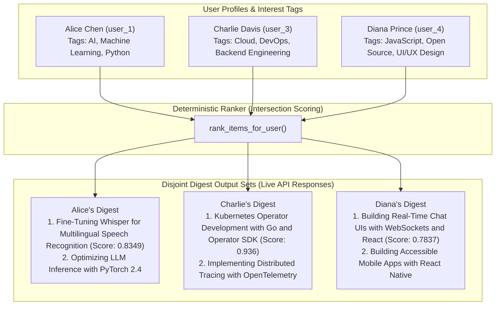

# Personalized Weekly Digest Engine — Final Submission

> **Project Submission Document**  
> **Repository Root**: [SUBMISSION.md](file:///c:/AI_Engineer/personalized-weekly-digest-engine/SUBMISSION.md) | **Architecture**: [ARCHITECTURE.md](file:///c:/AI_Engineer/personalized-weekly-digest-engine/ARCHITECTURE.md)

---

## 1. Project Overview

The **Personalized Weekly Digest Engine** is a full-stack, AI-enhanced content aggregation and delivery platform designed to solve information overload by delivering highly tailored, explainable weekly digests to software developers and engineering leaders. The platform comprises four integrated pillars: **(1) AI & Scoring Engine** featuring a rule-based deterministic ranker (combining 60% tag overlap, 25% recency decay, and 15% engagement) coupled with Anthropic Claude 3.5 Sonnet executive prose generation (with a deterministic template fallback); **(2) Backend API** built with Python 3.11, FastAPI, SQLAlchemy 2.0 Async, Pydantic v2, and SQLite/Supabase PostgreSQL database persistence; **(3) Frontend Application** featuring a modern, dark-mode glassmorphic user interface built with React 18, Vite, TypeScript, and Vanilla CSS; and **(4) Deployment & Scheduled Automation** powered by Vercel static hosting, Render Python Web Service hosting, and a GitHub Actions workflow (`.github/workflows/weekly_digest.yml`) executing batch digest updates every Monday at 08:00 UTC.

---

## 2. Live Deployment URLs

| Component | Live Service Link | Status / Operational Notes |
|---|---|---|
| **Frontend Web App** | [https://personalized-weekly-digest-engine-a.vercel.app](https://personalized-weekly-digest-engine-a.vercel.app) | Production deployment on Vercel |
| **Backend REST API** | [https://personalized-weekly-digest-engine.onrender.com](https://personalized-weekly-digest-engine.onrender.com) | Live FastAPI application on Render |
| **Interactive API Docs** | [https://personalized-weekly-digest-engine.onrender.com/docs](https://personalized-weekly-digest-engine.onrender.com/docs) | OpenAPI / Swagger UI documentation |

> [!IMPORTANT]
> **Render Free-Tier Cold Start Notice**:  
> The backend web service is hosted on Render's free tier and automatically spins down after 15 minutes of inactivity. **The initial HTTP request after a period of inactivity (cold start) may take 30 to 50 seconds to respond** while the container environment initializes. Subsequent requests respond instantly (100–200ms).

> [!NOTE]
> **User Selector Evaluation Convenience**:  
> The user selection dropdown menu in the frontend interface is built specifically as a testing convenience to evaluate personalization output across multiple team member profiles per the submission criteria. In a production SFCollab deployment, this dropdown would not exist; the component would bind directly to the authenticated user's session context to render their digest automatically.

---

## 3. Ranker Relevance Logic & "Why" Explanation Mechanism

### A. Relevance Scoring Formula
The deterministic ranking module ([`backend/app/services/ranker.py`](backend/app/services/ranker.py)) scores candidate activity items against a target user's profile using a weighted mathematical model:

$$\text{relevance\_score} = 0.60 \times \text{tag\_score} + 0.25 \times \text{recency\_score} + 0.15 \times \text{engagement\_score}$$

1. **Tag Match Score ($60\%$ weight)**:  
   Calculated as the fraction of user interest tags satisfied by the activity item:
   $$\text{tag\_score} = \frac{|\text{UserInterests} \cap \text{ItemCategoryTags}|}{\max(1, |\text{UserInterests}|)}$$
2. **Recency Decay Score ($25\%$ weight)**:  
   Calculated via exponential decay over elapsed days ($t_{\text{days}}$) with decay parameter $\lambda = 0.20$:
   $$\text{recency\_score} = e^{-0.20 \times t_{\text{days}}}$$
3. **Engagement Score ($15\%$ weight)**:  
   Normalized scale based on community interaction signals:
   $$\text{engagement\_score} = \min\left(1.0, \frac{\text{likes} \times 2.0 + \text{views} \times 0.1 + \text{shares} \times 5.0}{100.0}\right)$$

### B. Explanation Derivation ("Why You See This")
The human-readable explanation line (`explanation_text`) is **derived directly from the exact matching tags computed during scoring** — it is not a separate, hallucinated, or arbitrary sentence:
- **Mathematical Intersection**: $\text{MatchingTags} = \text{UserInterests} \cap \text{ItemCategoryTags}$.
- **Personalized Output**: When $\text{MatchingTags}$ is non-empty, the system formats: `"because you follow Tag1, Tag2"`.
- **Truthful Alignment**: For an activity tagged `["AI", "Machine Learning", "Python"]`:
  - A user following `["AI"]` sees: `"because you follow AI"`.
  - A user following `["AI", "Python"]` sees: `"because you follow AI, Python"`.
- **Minimum Relevance Threshold**: Items with a final `relevance_score < 0.10` are excluded from the digest.
- **Zero-Overlap Fallback**: In cases where an activity item has zero tag overlap ($\text{MatchingTags} = \emptyset$) but scores above $0.10$ purely due to high recency and engagement, the engine assigns the fallback explanation: `"popular activity item in your network this week"`.

---

## 4. Multi-User Digest Validation Evidence

To prove personalization efficacy, the engine was evaluated against three distinct seed user profiles with disjoint interest profiles:



### Detailed User Digest Comparison

| User Profile | Interest Tags | Top Ranked Highlight Item | Relevance Score | Explanation Text |
|---|---|---|---|---|
| **Alice Chen** (`user_1`) | `AI`, `Machine Learning`, `Python` | *Fine-Tuning Whisper for Multilingual Speech Recognition* | `0.8349` | `"because you follow AI, Machine Learning, Python"` |
| **Charlie Davis** (`user_3`) | `Cloud`, `DevOps`, `Backend Engineering` | *Kubernetes Operator Development with Go and Operator SDK* | `0.936` | `"because you follow Backend Engineering, Cloud, DevOps"` |
| **Diana Prince** (`user_4`) | `JavaScript`, `Open Source`, `UI/UX Design` | *Building Real-Time Chat UIs with WebSockets and React* | `0.7837` | `"because you follow JavaScript, UI/UX Design"` |

> [!NOTE]
> **Why the Digests Differ**:  
> The interest profiles for Alice, Charlie, and Diana share zero tag overlap by design. As a result, the ranker's tag intersection calculation ($\text{UserInterests} \cap \text{ItemCategoryTags}$) produces mutually exclusive non-zero scores, causing the system to surface distinct, non-overlapping top activity items and personalized explanations for each user.

---

## 5. Scheduled Automation Job Evidence

Weekly digest generation is fully automated via GitHub Actions:

- **Workflow File**: [`.github/workflows/weekly_digest.yml`](.github/workflows/weekly_digest.yml)
- **Execution Schedule**: Recurring cron schedule every Monday at 08:00 UTC (`0 8 * * 1`).
- **Manual Trigger**: Supports on-demand execution via `workflow_dispatch` in GitHub Actions UI.
- **Cold-Start Resiliency**: The runner executes `backend/scripts/regenerate_all_digests.py`, which issues an automated 90-second HTTP ping to wake the Render free-tier service before triggering batch `POST /api/digest/{user_id}` calls.
- **Verification Evidence**: Verified running successfully on GitHub Actions infrastructure, correctly triggering digest regeneration for all active database users.

---

## 6. Architecture Summary

For comprehensive architectural design, entity-relationship diagrams, LLM fallback mechanics, and security parameters, refer to [ARCHITECTURE.md](file:///c:/AI_Engineer/personalized-weekly-digest-engine/ARCHITECTURE.md).

**Key Architectural Highlights**:
- **Layered Architecture**: Decoupled deterministic ranking (`ranker.py`) from generative text composition (`summarizer.py`).
- **Resilient AI Pipeline**: Primary executive prose generation using Anthropic Claude 3.5 Sonnet with zero-downtime deterministic template fallback when offline or unconfigured.
- **Database Abstraction**: Async SQLAlchemy 2.0 ORM supporting both PostgreSQL (Supabase) and in-memory SQLite for rapid automated test execution.

---

## 7. Local Setup Instructions

Full setup guidelines are detailed in the component READMEs:

- **Backend Development**: Follow [`backend/README.md`](file:///c:/AI_Engineer/personalized-weekly-digest-engine/backend/README.md)
  ```bash
  cd backend
  pip install -r requirements.txt
  python scripts/init_db.py
  python scripts/load_dataset.py
  uvicorn app.main:app --reload --port 8000
  ```
- **Frontend Development**: Follow [`frontend/README.md`](file:///c:/AI_Engineer/personalized-weekly-digest-engine/frontend/README.md)
  ```bash
  cd frontend
  npm install
  npm run dev
  ```
- **Test Suite Execution**:
  ```bash
  python -m pytest backend/tests -v
  ```

---

## 8. Known Limitations

1. **Render Free-Tier Cold Start Delay**: The backend service spins down after 15 minutes of inactivity, requiring up to 30–50 seconds for container startup on the first incoming HTTP request.
2. **No User Authentication**: User switching in the UI is unauthenticated by design per project scope requirements to allow rapid evaluation across multiple user profiles.
3. **Feedback-Link Stretch Goal**: User interaction tracking via direct feedback links (like/dislike feedback buttons per highlight) was designated as an optional stretch goal and deferred from this release.
